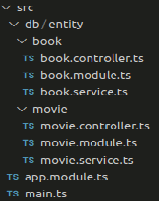
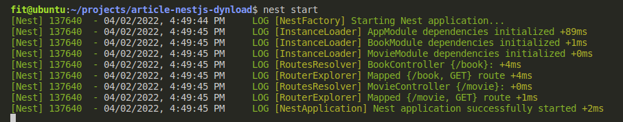
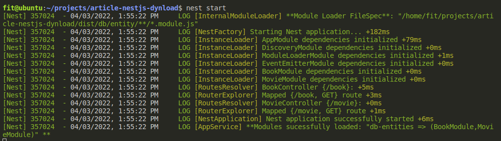

# NestJS with dynamic module loading


## Description

[**NestJS**](https://github.com/nestjs/nest) is is a well-built server side Typescript framework that implements important design patterns like [**Dependency Injection Principle**](https://en.wikipedia.org/wiki/Dependency_injection).

NestJS centralizes all the needed tecnologies to build consistent micro-services or monolithic servers using Nodejs.

NestJS uses three main build blocks to form an application:

- Controllers
- Providers
- Modules

> **Controllers** in NestJS are responsible for handling any incoming requests and returning responses to the client side of the application.

> **Providers** (also called services) can be created and injected into controllers or other providers. Providers are designed to abstract any form of complexity and logic.

> **Modules** let you group related files. Providers and controllers are referenced through modules. In NestJS, modules encapsulate providers by default. In other words, it is not possible to inject providers into a module that are not part of the module or exported from another module. Modules can import other modules - basically, this enables sharing of providers across modules.

Below is a diagram that illustrates the concept of modules in NestJS.


As you can see, every application has at least one root module (the application module). The **root module** is basically the starting point that NestJS uses to build the **application graph**.

In nestjs modules are defined as classes with the @Module decorator that takes a object as input which has sections (properties) to create the relationship between modules, providers and controllers:

> **Providers** It takes a list of providers as input. These providers will be instantiated by the NestJS injector. By default, a Provider belonging to a Module will be available within the module.

> **Controllers** This array specifies the set of controllers in the module. Basically, NestJS will automatically instantiate them during startup.

> **Imports** In this section, we can specify the list of imported modules. Basically, this enables sharing of providers across modules

> **Exports** This specifies the providers that are provided by this module. In other words, we specify the providers that are exported by this module.

## Pre-requisites

We assume you have **git cli**, **nodejs** and **nestjs cli** installed on your system. This tutorial was run in a **_linux environment_**, but you would easily tweak this for your preferred operating system.

## A simple NestJS Application

We will create two versions of an API to access the contents of two entities (tables) in a pseudo-database - just looking for items by its id.

The first version made in the conventional format where we will import into the appmodule each of the two modules that encapsulate the entities.

The second version will dynamically import any and all modules present in the /src/db/entity subdirectory

This is cool, as if you create new modules for new entities in this subdirectory, those modules will be dynamically imported without you having to reference them. You will just create them and they will be part of the system automatically

In this way our system will have this format:


## The entity unit

For each entity we will have a controller that will respond to HTTP requests, a service (used by controller) that will perform a search on the entity's data and a module that will refer to the corresponding controller and service (as depicted in the diagram above we have the units corresponding to the entities **Book** and **Movie**).

## Version **WITHOUT** dynamic module loading

Enough of theory, let's put the dough to work!

Below we have the subdirectory with our API application:



Let's examine the most relevant source codes

### **_app.module.ts_**

The root module **_app.module.ts_** simply imports the Book and Movie entity modules into the system.

```typescript
import { Module } from '@nestjs/common';
import { BookModule } from './db/entity/book/book.module';
import { MovieModule } from './db/entity/movie/movie.module';

@Module({
  imports: [BookModule, MovieModule],
})
export class AppModule {}
```

The db/entity subdirectory contains the list of entities (Book and Movie) with their respective module, provider and controller files. Due to similarity, we will only examine the source code of the Book entity.

### **_book.module.ts_**

The module **_book.module.ts_** is also very simple. Just load controller **_book.controler.ts_** and make provider **_book.service.ts_** available.

```typescript
import { Module } from '@nestjs/common';
import { BookService } from './book.service';
import { BookController } from './book.controller';

@Module({
  controllers: [BookController],
  providers: [BookService],
})
export class BookModule {}
```

### **_book.controller.ts_**

The controller **_book.controller.ts_** responds for HTTP GET requenst on the path **/book** accepting the **ID** parameter and just returns the book with the
corresponding ID.

The controller uses the **book.service.ts** service's findById method to search and return the book corresponding to the **ID**.

```typescript
import { Controller, Get, ParseIntPipe, Query } from '@nestjs/common';
import { BookService, Book } from './book.service';

@Controller('book')
export class BookController {
  constructor(private readonly bookService: BookService) {}

  @Get()
  getBook(@Query('id', ParseIntPipe) id: number): Book {
    return this.bookService.findById(id);
  }
}
```

### **_book.service.ts_**

Finally, the **_book.service.ts_** service simply provides the **findoById** method that returns a book by its **ID** from a pseudo table of books.

```typescript
import { Injectable } from '@nestjs/common';

export interface Book {
  id: number;
  title: string;
}

@Injectable()
export class BookService {
  private static _books: Array<Book> = [
    {
      id: 1,
      title: 'Nest.js: A Progressive Node.js Framework (English Edition)',
    },
    { id: 2, title: 'NestJS Build a RESTFul CRUD API' },
    { id: 3, title: 'Pratical Nest.js' },
  ];

  findById(id: number): Book {
    return BookService._books.find((book) => book.id === id);
  }
}
```

### Executing the API

When running the API with the command:

```bash
# Run the NestJS server application
$ nest start
```

You will see the following messages on your console:



Easy and clean. Now let's complicate things a bit.

## Version **WITH** dynamic module loading

NestJS natively has an implementation for [**lazy-loading of modules**](https://docs.nestjs.com/fundamentals/lazy-loading-modules) that allows you to not have to load all modules during startup.

What we are proposing here is not this. We load it at startup but without manually loading each module.

To load the modules dynamically we use [**GLOBs**](<https://en.wikipedia.org/wiki/Glob_(programming)>) to find the modules in a certain subdirectory and the native function **_import()_** to load and extract the Module from the corresponding JS file (remember that this load is at runtime and we are no longer in the TS land).

After changing the original project we have the following changes:

### **_app.module.ts_**

The main changes to root module **_app.module.ts_** are:

- No longer explicitly loads the entity unit modules (book and movie).

- We provide an **_app.service.ts_** just to receive an event when dynamic modules are loaded and show it in the console.

- We use the **_register_** method of our dynamic module loader (**_ModuleLoaderModule_**) by specifying an options parameter with information on where to dynamically load the modules.

We have the following source code:

```typescript
import { Module } from '@nestjs/common';
import { EventEmitterModule } from '@nestjs/event-emitter';
import * as path from 'path';
import { AppService } from './app.service';
import { ModuleLoaderModule } from './common/module-loader.module';

@Module({
  imports: [
    EventEmitterModule.forRoot({ wildcard: true }),
    /**
     * Load all entity unit modules in subdirectory /db/entity
     */
    ModuleLoaderModule.register({
      name: 'db-entities',
      /**
       * Make sure the path resolves to the **DIST** subdirectory, (we are no longer in TS land but JS land!)
       */
      path: path.resolve(__dirname, './db/entity'),
      fileSpec: '**/*.module.js',
    }),
  ],
  providers: [AppService],
})
export class AppModule {}
```

### The dynamic module loader

We have three new sources that do the dynamic loading service in **_/common_** subrirectory:

- **_module-loader-defs.ts_** - This file contains the definitions used by the dynamic loads module.

- **_module-loader.service.ts_** - It only emits an event at the end of the dynamic load of modules.

- **_module-loader.module.ts_** - That actually does the dirty work.

### **module-loader-defs.ts**

```typescript
import { ModuleRef } from '@nestjs/core';

/**
 * Constants used in ModuleLoader implementation
 */
export const MODULE_LOADER_OPTIONS = 'MODULE_LOADER_OPTIONS';
export const MODULE_LOADER_NAMES = 'MODULE_LOADER_NAMES';
export const MODULE_LOADER = 'MODULE_LOADER';
export const EV_MODULE_DYN_LOADER = 'EV_MODULE_DYN_LOADER.';

/**
 * Options interface for ModuleLoaderModule.register
 */
export interface IModuleLoaderOptions {
  /**
   * Name of modules
   */
  name: string;
  /**
   * Path's modules to load
   */
  path: string;
  /**
   * Depth to search modules inside of directories's path
   * default: -1 (INFINITY) - searches in root path only
   */
  depht?: number;
  /**
   * File spec to match - accepts globs and list of globs/file names
   * default: '*.module.ts'
   */
  fileSpec?: string | Array<string>;
  /**
   * File spec to ignore - accepts globs and list of globs/file names
   */
  ignoreSpec?: string | Array<string>;
}

/**
 * Event type fired when modules are loaded
 */
export interface IModuleDynLoaderEvent {
  name: string;
  moduleNames?: Array<string>;
  error?: Error | string;
}
```

### **module-loader.service.ts**

```typescript
import { Injectable, Inject, Scope, OnModuleInit } from '@nestjs/common';
import {
  MODULE_LOADER_OPTIONS,
  MODULE_LOADER_NAMES,
  EV_MODULE_DYN_LOADER,
  IModuleLoaderOptions,
} from './module-loader-defs';
import { EventEmitter2 } from '@nestjs/event-emitter';
import { nextTick } from 'process';

@Injectable({
  scope: Scope.TRANSIENT,
})
export class ModuleLoaderService implements OnModuleInit {
  constructor(
    @Inject(MODULE_LOADER_OPTIONS) private _options: IModuleLoaderOptions,
    @Inject(MODULE_LOADER_NAMES) private _moduleNames: Array<string>,

    private eventEmitter: EventEmitter2,
  ) {}

  /**
   * @description Emmits as events when modules are loaded
   */
  onModuleInit() {
    nextTick(() => {
      const eventName = EV_MODULE_DYN_LOADER + this._options.name;
      this.eventEmitter.emit(eventName, {
        name: this._options.name,
        moduleNames: this._moduleNames,
      });
    });
  }
}
```

### **module-loader.service.ts**

```typescript
import { Logger, Module, DynamicModule } from '@nestjs/common';
import * as fb from 'fast-glob';
import * as path from 'path';
import { ModuleLoaderService } from './module-loader.service';
import {
  MODULE_LOADER,
  MODULE_LOADER_OPTIONS,
  MODULE_LOADER_NAMES,
  IModuleLoaderOptions,
} from './module-loader-defs';

export const moduleLoaderFactory = {
  provide: MODULE_LOADER,
  useFactory: (moduleLoaderService: ModuleLoaderService) => {},
  inject: [ModuleLoaderService],
};

interface IModuleInfo {
  name: string;
  module: DynamicModule;
}

/**
 * @description helper static class to load modules dynamically.
 */
class InternalModuleLoader {
  static readonly logger = new Logger(InternalModuleLoader.name);

  /**
   * @param _options for GLOB searches
   * @returns a Promise thats resolves to a list of name and module references based on _options filespec
   */
  static async loadModules(
    _options: IModuleLoaderOptions,
  ): Promise<Array<IModuleInfo>> {
    return new Promise((resolve, reject) => {
      this.getModuleFileNames(_options).then((filePaths: Array<string>) => {
        if (filePaths.length == 0) {
          resolve([]);
        } else {
          const loadedModules: Array<Promise<any>> = filePaths.map((filePath) =>
            this.loadModule(filePath),
          );
          if (loadedModules.length === 0) {
            resolve([]);
          } else {
            const moduleInfos: Array<IModuleInfo> = new Array();
            Promise.all(loadedModules).then((modules: Array<any>) => {
              for (let i = 0; i < modules.length; i++) {
                let module = modules[i];
                const moduleField = Object.keys(module).find(
                  (key) => key.indexOf('Module') >= 0,
                );
                if (moduleField) {
                  moduleInfos.push({
                    name: moduleField,
                    module: module[moduleField],
                  });
                }
              }
              resolve(moduleInfos);
            });
          }
        }
      });
    });
  }

  /**
   * @description Uses native import() to dynamicly load a module
   * @param modulePath
   * @returns a Promise thats resolves to module loaded
   */
  private static async loadModule(modulePath: string): Promise<any> {
    return import(modulePath);
  }

  /**
   * @description Uses FatsGlob to load the filenames for the modules
   * @param _options for GLOB searches
   * @returns a list of module's file paths
   */
  private static async getModuleFileNames(
    _options: IModuleLoaderOptions,
  ): Promise<Array<string>> {
    const spec: Array<string> = (
      typeof _options.fileSpec === 'string'
        ? [_options.fileSpec]
        : _options.fileSpec
    ).map((fileSpec) => path.join(_options.path, fileSpec));
    let options: fb.Options = {
      onlyFiles: true,
    };
    if (_options.depht) {
      options.deep = _options.depht < 0 ? Infinity : _options.depht;
    }
    if (_options.ignoreSpec) {
      options.ignore = Array.isArray(_options.ignoreSpec)
        ? _options.ignoreSpec
        : [_options.ignoreSpec];
    }
    this.logger.log(`**Module Loader FileSpec**: "${spec}"`);

    return fb(spec, options);
  }
}

@Module({})
export class ModuleLoaderModule {
  /**
   * @description Load Modules dynamically via GLOBs and native import() function.
   * @param moduleLoaderOptions options for GLOB searches
   */
  public static async register(
    moduleLoaderOptions: IModuleLoaderOptions,
  ): Promise<DynamicModule> {
    const moduleInfos = await InternalModuleLoader.loadModules(
      moduleLoaderOptions,
    );
    const modules = moduleInfos.map((moduleInfo) => moduleInfo.module);
    const moduleNames = moduleInfos.map((moduleInfo) => moduleInfo.name);

    return {
      module: ModuleLoaderModule,
      imports: [...modules],
      providers: [
        {
          provide: MODULE_LOADER_OPTIONS,
          useValue: moduleLoaderOptions,
        },
        {
          provide: MODULE_LOADER_NAMES,
          useValue: moduleNames,
        },
        ModuleLoaderService,
        moduleLoaderFactory,
      ],
    };
  }
}
```

When running the API with the command:

```bash
# Run the NestJS server application
$ nest start
```

You will see the following messages on your console (_notice that the modules of the book and movie entities units were properly loaded dynamically_):



## Running the example from this tutorial

### Installation

```bash
# Clone tutorial repository
$ git clone https://github.com/maceto2016/NestJSDynLoad

# access the project folder through the terminal
$ cd NestJSDynLoad

# Install dependencies
$ npm install
```

### Running the application (from NestJSDynLoad folder)

```bash
# Run the NestJS server application
$ nest start
```

### Testing the application

```bash
# Get book with id = 1
$ curl http://localhost:3000/book?id=1 | json_pp
```

## Conclusion

In this tutorial we made a small introduction to the well-built NestJS framework.

We demonstrate how to dynamically load all modules present in a given subdirectory into your NestJS application without the need for you to manually reference such modules in code. This can be practical in some situations.

The principles used in this article allow for various implementations including your own version of module lazy-loading.

Could you be implementing the **_registerAsync_** version using the NestJS ConfigService to load the file list from fileSpec defines in env files?

It's up you!

I thank you for reading. I would be happy to hear your feedback!
