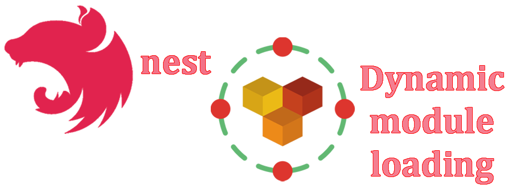
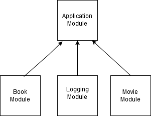
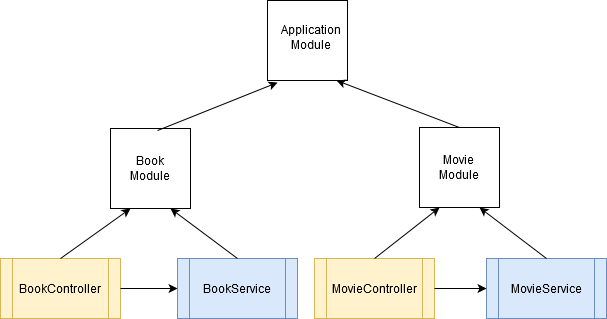

# NestJS with dynamic module loading



## Description

[NestJS](https://github.com/nestjs/nest) is a server-side Typescript framework.

NestJS centralizes all the needed tecnologies to build consistent micro-services or monolithic servers using Nodejs.

NestJS uses three main build blocks to form an application:

- Controllers
- Providers
- Modules

> **Controllers** in NestJS are responsible for handling any incoming requests and returning responses to the client side of the application.

> **Providers** (also called services) can be created and injected into controllers or other providers. Providers are designed to abstract any form of complexity and logic.

> **Modules** let you group related files. Providers and controllers are referenced through modules. In NestJS, modules encapsulate providers by default. In other words, it is not possible to inject providers into a module that are not part of the module or exported from another module. Modules can import other modules - basically, this enables sharing of providers across modules.

Below is a diagram that illustrates the concept of modules in NestJS.



As you can see, every application has at least one root module (or the application module - root module). The **root module** is basically the starting point that NestJS uses to build the **application graph**.

In nestjs modules are defined as classes with the @Module decorator that takes a object as input which has sections (properties) to create the relationship between modules, providers and controllers:

> **Providers** It takes a list of providers as input. These providers will be instantiated by the NestJS injector. By default, a Provider belonging to a Module will be available within the module.

> **Controllers** This array specifies the set of controllers in the module. Basically, NestJS will automatically instantiate them during startup.

> **Imports** In this section, we can specify the list of imported modules. Basically, this enables sharing of providers across modules

> **Exports** This specifies the providers that are provided by this module. In other words, we specify the providers that are exported by this module.

Enough of theory, let's put the dough to work!

## Pre-requisites

We assume you have **git cli**, **nodejs** and **nestjs cli** installed on your system.

## A simple NestJS Application

We will create two versions of an API to access the contents of two entities (tables) in a pseudo-database - just looking for items by its id.

The first version made in the conventional format where we will import into the appmodule each of the two modules that encapsulate the entities.

The second version will dynamically import any and all modules present in the /src/dbschema subdirectory

This is cool, as if you create new modules for new entities in this subdirectory, those modules will be dynamically imported without you having to reference them.

In this way our system will have this format:



## The entity unit

For each entity we will have a controller that will respond to HTTP requests, a service (used inside controller) that will perform a search on the entity's data and a module that will refer to the corresponding controller and service:

## Installation

```bash
# Clone tutorial repository
$ git clone https://github.com/maceto2016/NestJSDynLoad

# access the project folder through the terminal
$ cd NestJSDynLoad

# Install dependencies
$ npm install
```

## Running the app (from NestJSDynLoad folder)

```bash
# Run the NestJS server app
$ nest start
```

## License

Nest is [MIT licensed](LICENSE).
